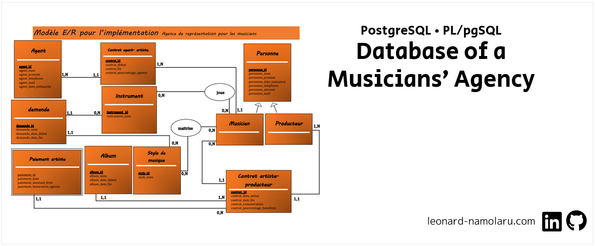

[Français](#français-base-de-données-pour-une-agence-représentant-des-musiciens) • [English](#english-database-for-an-agency-representing-musicians)  • [עברית](#עברית-מסד-נתונים-של-סוכנות-המייצגת-מוזיקאים)

### [Français] Base de données pour une agence représentant des musiciens
> :school: **Lieu de formation :** Université Paris Cité, Campus Grands Moulins (ex-Paris Diderot)
> 
> :books: **UE :** Bases de données avancées 
> 
> :pushpin: **Année scolaire :** M1
> 
> :calendar: **Dates :** Avr. 2022 - mai 2022 
> 
> :chart_with_upwards_trend: **Note :** 18/20

#### Description
L’objectif du projet est la modélisation, le peuplement, et la mise en place d’une base de données d’une agence artistique. Dans ce contexte nous avons décidé d'axer notre projet sur la création d'une base de données pour une agence représentant des musiciens.

#### Principales fonctionnalités

- Création d’indexes qui permettent d’optimiser les requêtes les plus fréquentes.
- Fonctions PL/pgSQL pour les opérations courantes + tests qui permettent d’illustrer l’action de ces fonctions.
- Triggers + tests qui permettent d’illustrer les déclenchement de chaque trigger.

#### Les données

- 1000 musiciens
- 1000 agents
- 1000 producteurs
- 6 instruments
- 6 styles de musique
- 50 demande
- 100 contrat agence artiste
- 30 albums

Pour générer les données sous forme de fichiers csv, nous avons utilisé l'outil 'Mockaroo' qui est un générateur de données.

#### Instructions pour le démarrage
Afin de démarrer le projet, veuillez suivre les instructions ci-dessous :

1. Création d'une base de données
```
postgres=# CREATE DATABASE projet_bdd;
postgres=# \c projet_bdd;
```

2.L'importation du fichier create_all.sql peut être effectuée par la commande suivante :
```
projet_bdd=# \i 'C:/Users/lenny/git/bdav-agence-artistique/CREATION/create_all.sql'
```

3. `\include 'C:/Users/lenny/git/bdav-agence-artistique/CREATION/create_triggers.sql'`
4. `\include 'C:/Users/lenny/git/bdav-agence-artistique/CREATION/create_functions.sql'`

5. Ouvrez le fichier `/CREATION/insert_data.sql` et modifiez les chemins des fichiers .csv en fonction de l'emplacement où ils se trouvent sur votre ordinateur. Pour éviter de recevoir des messages d'erreur de type `ERREUR:  n'a pas pu ouvrir le fichier ... pour une lecture : Permission denied`,
il est recommandé de placer les fichiers sous le dossier `C:\Users\Public` (si vous utilisez Windows) ou sous `~/` (si vous utilisez Mac ou Linux) [1].

6. Les données peuvent maintenant être importées :
```
projet_bdd=# \i 'C:/Users/lenny/git/bdav-agence-artistique/CREATION/insert_data.sql'
```

Si vous recevez un message d'erreur de type `ERREUR: valeur du champ date/time en dehors des limites ...Peut-être avez-vous besoin d'un paramétrage « datestyle » différent.`, une façon de résoudre ce problème est de taper la commande suivante (pour le format : dd/mm/yyyy) [2] :
```
projet_bdd=# SET DATESTYLE = US; 
```

 _[1] Permission Denied error when using PostgreSQL's COPY FROM/TO command : https://www.neilwithdata.com/copy-permission-denied_

_[2] PostgreSQL Documentation_
    _https://www.postgresql.org/docs/9.1/datatype-datetime.html#DATATYPE-DATETIME-OUTPUT2-TABLE_
    _https://www.postgresql.org/docs/7.2/sql-set.html_

#### fonctions PL/pgSQL pour les opérations courantes de gestion
Les fonctions suivantes sont à votre disposition :

TABLE MUSICIEN
```
----- musicien_existe(nom text, prenom text, date_naissance date, telephone text, adresse text, mail text) -> INTEGER
Description : Une fonction qui reçoit comme paramètres nom, prenom, téléphone, etc. et vérifie si un tel musicien existe.

Parametres :
nom text : la nom du musicien.
prenom text : le prenom du musicien.
date_naissance date : la date de naissance du musicien
telephone text : le telephone de l'agent (format : '123-456-1234')
adresse text : l'adresse du musicien
mail text : l'adresse mail du musicien (format : 'X@Y.Z')
  
Valeur de retour : le numero d'id du musicien si il existe ou -1 en cas d’erreur (le musicien existe PAS).
```

```
-----  ajout_musicien(nom text, prenom text, date_naissance date, telephone text, adresse text, mail text, instruments INTEGER[], styles_musique INTEGER[]) -> BOOLEAN
Description : Une fonction qui reçoit comme paramètres : nom, prenom, téléphone, etc. et ajoute un nouveau musicien s'il n'existe pas deja.
               De plus, la fonction reçoit en paramètre 2 tableaux : 
                - un tableau des id des instruments de musique que le musicien maitrise
                - un tableau des id des styles de musique du musicien. 
              La fonction ajoute ces informations aux tables appropriées.
 
Parametres :
nom text : la nom du musicien.
prenom text : le prenom du musicien.
date_naissance date : la date de naissance du musicien
telephone text : le telephone de l'agent (format : '123-456-1234')
adresse text : l'adresse du musicien
mail text : l'adresse mail du musicien (format : 'X@Y.Z')
instruments INTEGER[] : un tableau des id des instruments de musique que le musicien maitrise (Par exemple : '{1,2}')
 styles_musique INTEGER[] : un tableau des id des styles de musique du musicien (Par exemple : '{1,2}')

Valeur de retour : true si le musicien est ajouté avec succès, false si le musicien existe déjà.
```

TABLE CONTRAT_ARTISTE_PRODUCTEUR
```
-----  contrat_reste_a_payer(id_contrat integer) ->  integer
Description : Trouver les demandes adaptées a un musicien. C'est-à-dire des demandes qui 
               n'ont pas encore expiré (qui n'ont pas encore atteint leur date de fin) et 
               qui incluent des instruments de musique et un style de musique qui conviennent au musicien.
 
Parametres :
id_contrat integer : ID du contrat artiste producteur.

Valeur de retour : La fonction retourne le reste a payer (somme de la renumeration total - paiements anterieurs)
```

TABLE DEMANDE
```
-----  trouver_musiciens_repondre_demande(id_demande integer, musiciens_exclure_resultats integer[]) -> BOOLEAN
Description : Trouver des musiciens pour répondre à une demande. C'est-à-dire que la fonction trouve la liste des musiciens 
 			  qui contrôlent l'instrument qui apparaît dans la demande et en même temps ce sont des musiciens dont le style 
               de musique est tel qu'il apparaît dans la demande.
 
Parametres :
id_demande integer : ID de la demande.

Valeur de retour : La fonction retourne un type “ensemble” (SETOF) de la table musicien 
```

```
-----  trouver_demandes_adaptees_musicien(id_musicien integer)  ->  SETOF demande
Description : Trouver les demandes adaptées a un musicien. C'est-à-dire des demandes qui 
              n'ont pas encore expiré (qui n'ont pas encore atteint leur date de fin) et 
              qui incluent des instruments de musique et un style de musique qui conviennent au musicien.
 
Parametres :
id_musicien integer : ID du musicien.

Valeur de retour : La fonction retourne un type “ensemble” (SETOF) de la table demande 
```

TABLE CONTRAT_AGENT_ARTISTE
```
----- exportation_contrats_en_vigueur(systeme_exploitation text) -> void
Description : Exportation de tous les contrats actuellement en vigueur. 
               La destination pour l'exportation sur Windows : C:\Users\Public\contrats_en_vigueur.csv 
 	          La destination pour l'exportation sur Linux ou Mac : /tmp/contrats_en_vigueur.csv

Parametres :
systeme_exploitation text : Cette fonction ne peut accepter que une les valeurs suivantes en tant que parametre : WINDOWS LINUX MAC.

Valeur de retour : void
```

TABLE AGENT
```
----- agent_existe(nom text, prenom text, telephone text, date_embauche DATE) -> INTEGER
Description : Une fonction qui reçoit comme paramètres nom, prenom, téléphone, etc. et vérifie si un tel agent existe.

Parametres :
nom text : la nom de l'agent.
prenom text : le prenom de l'agent.
telephone text : le telephone de l'agent (format : '123-456-1234')
date_embauche DATE : la date d'embauche de l'agent

Valeur de retour : le numero d'id de l'agent si il existe ou -1 en cas d’erreur (l'agent existe PAS).
```

```
----- ajout_agent(nom text, prenom text, telephone text, date_embauche DATE) -> BOOLEAN
Description : Une fonction qui reçoit comme paramètres : nom, prenom, téléphone, etc. et ajoute un nouveau agent s'il n'existe pas deja.
 
Parametres :
nom text : la nom de l'agent.
prenom text : le prenom de l'agent.
telephone text : le telephone de l'agent (format : '123-456-1234')
date_embauche DATE : la date d'embauche de l'agent

Valeur de retour : true si l'agent est ajouté avec succès, false si l'agent existe déjà.
```

### [English] Database for an Agency Representing Musicians

### [עברית] מסד נתונים של סוכנות המייצגת מוזיקאים

